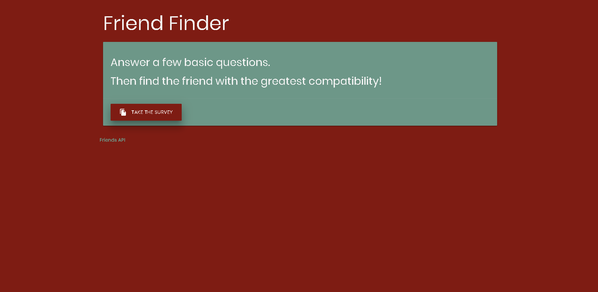
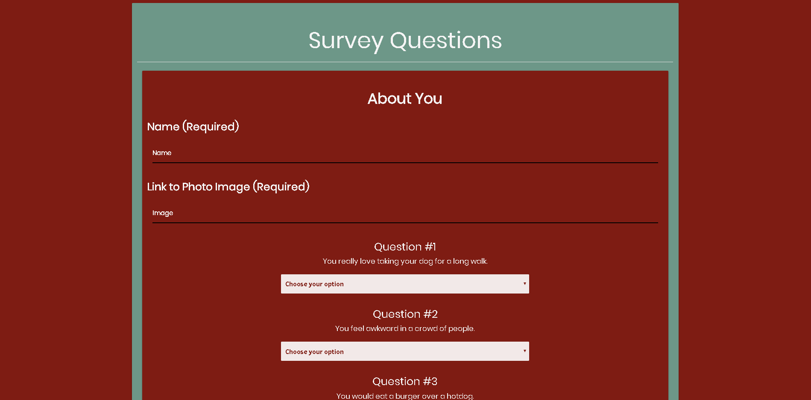
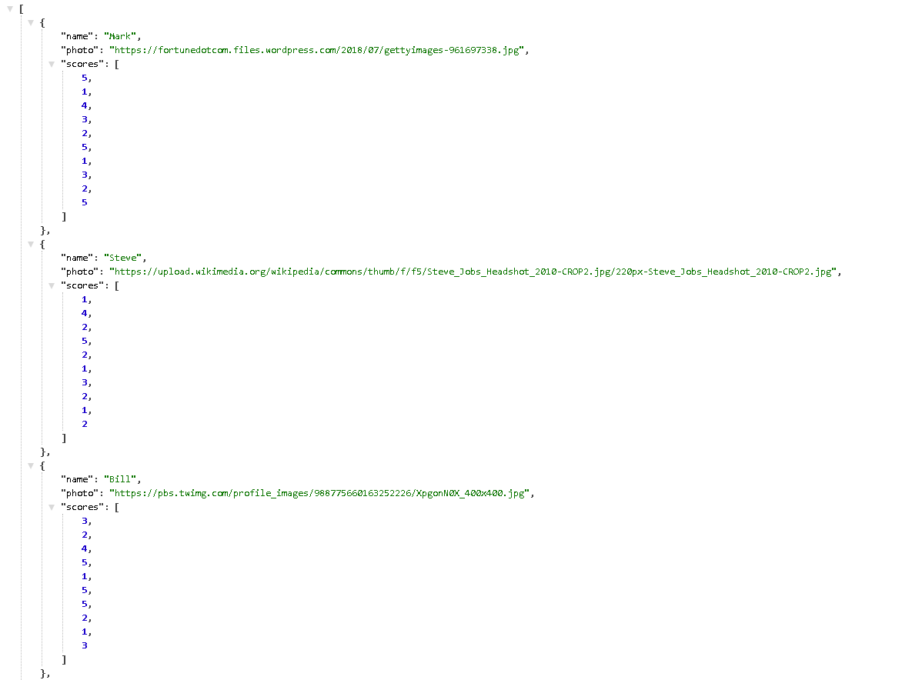

# friend-finder

### Check out the live version on heroku
**[Friend Finder](https://human-friend-finder.herokuapp.com/)**

## Description 

*Friend Finder* lets the user take a ten question survey. The Questions are from **1** *(strongly disagree)* to **5** *(strongly agree)* When the user submits the survey, it will then match you with others who have taken the survey based upon the user with the lowest absolute difference for all ten questions combined. The users data will be stored in the Friends Api, link is at the bottom of the main page and survey.

## Technologies used
- Node.js
- Javascript
- Jquery
- Materialize
- HTML/CSS
- NPM body-parser
- NPM express 
- NPM path

## Instructions for local use
**prerequisites**
- Install node.js/npm

    - Git-Clone to repo to a spot on your desktop
    - in your favorite CLI (gitbash/terminal) cd to the folder with .git
    - open in your favorite text editor
    - run npm install
    - run node server.js

# Author
## *Joshua LeBoeuf*

### Friends Api Preview

